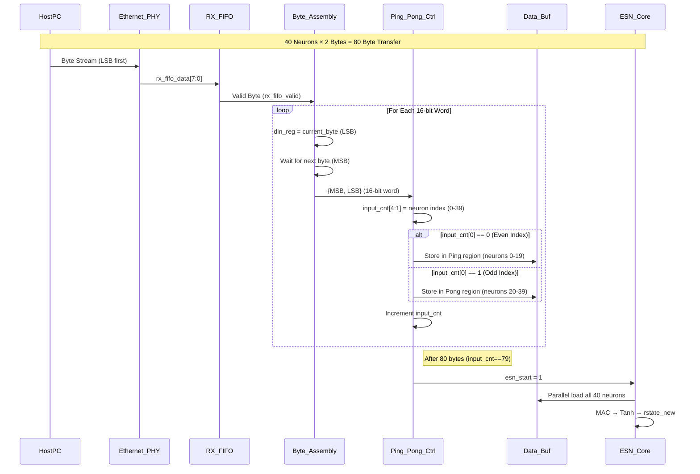
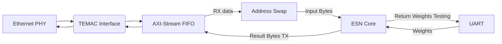

# RNN-MIMO-Ethernet-accelerator
This repository hosts the RTL design & FPGA implementation of a hardware-friendly RNN inference accelerator for MIMO-OFDM symbol detection on a Xilinx VC-707 FPGA. 

# Brief Details

This project contains design architecture similar to the following research papers:

- [Leveraging neuro-inspired AI accelerator for high-speed computing in 6G networks](https://www.frontiersin.org/journals/computational-neuroscience/articles/10.3389/fncom.2024.1345644/full) – Published in *Frontiers in Computational Neuroscience*, 2024.

- [Accelerating next-g wireless communications with fpga-based ai accelerators](https://ieeexplore.ieee.org/abstract/document/10323918) – Published in *2023 IEEE/ACM International Conference on Computer Aided Design (ICCAD)*, 2024.

# Folder Contents :

- **RTL_files**: This folder contains two following subfolders :

  --> **RNN_Accelerator**: The source files for the RNN accelerator (esn_core.v) it's submodules along with testbench for core design verification with datasets and python trained weights.

  --> **Ethernet_UART_Interface** : The RTL modifications and required submodules for establishing data communication between host PC and the Accelerator through Ethernet-PHY IP and UART protocol
  

- **ESN_MIMO_e3** : This folder contains the RTL implementation and the project archive in vivado format (.xpr) for the RNN accelerator and it's establishment of data communication with host PC through Ethernet and UART protocol using TEMAC Ethernet IP wrapper and UART HDL wrappers respectively.

- **ESN_MIMO_python** : This folder contains the RNN accelerator python software code which is used to train the network on MIMO symbol detection datasets and extract the trained parameters to hardcode them on the FPGA RNN inference chip RTL.

- **Matlab_UDP_transfer** : The matlab scripts required to send the dataset inputs and receive predicted symbol values using Ethernet-UDP payload. Also, to load the python trained weights to the RNN weight memories through UART protocol.

# Key Features

## Key Feature 1: Data-loading with Ping-Pong buffer

(Using Ping-Pong buffer for seamless data loading to 40 input neurons of RNN network in parallel)

-**`esn_core.v`** contains the top level module with glue logic for instatntiated submodule for the RNN accelerator
- The RNN input has 40 neurons with each neuron taking 16 bit of data
- The 40 input datas have to be laoded in parallel to RNN at a clock edge
- The AXI FIFOs can only send 1 Byte of data at a clock edge
- A Ping-Pong data buffer is used to load all the 40 input neuron in a odd-even indexing mechanism 
- Once the data buffer is filled with 40 input data, the esn_start=1 and data is loaded to RNN parallelwise

## Key Feature 2: UART + Ethernet Communication Pipeline

(On board RTL implementation for UART driver and Ethernet communication between FPGA and Host PC)

- **`digitalesn_top.v`** is the top module that integrates the **ESN accelerator**, **UART control logic**, and **Ethernet/UDP configuration** for host–FPGA interaction.

- The trained weight parameter files are:
  - Loaded through the **`loadweights`** module into the accelerator (**`esn_core.v`**),
  - Then returned back to the host PC via the **`return_conf`** module, confirming successful on-board memory write.
 
    
- **`eth_gmii_temac_design.v`** is the top-level RTL for interfacing with the **TEMAC Ethernet PHY**.
  
  It handles bidirectional communication of Wi-Fi channel data and prediction results using the following procedure:

  1. **Ethernet PHY (TEMAC IP)** receives UDP dataframes from the host (e.g., MATLAB script) formatted as `{DA, SA, Data}`.
     These frames are passed from the **`eth_sgmii_support`** module to the **AXI RX-FIFO** provided by the **`temac_fifo_block`** module wrapper.

  2. The **`temac_address_swap`** module detects frame boundaries and generates a **`udp_payload`** signal.
     This signal identifies valid payload data for the **`esn_core.v`** accelerator, stripping out DA/SA headers.

  3. After processing, the predicted RC symbol values are written back to the **AXI TX-FIFO**, connected to the **TEMAC GMII TX (`gmii_txd`)** interface for transmission back to the host PC.

  4. The host (e.g., MATLAB) opens a predefined UDP port to receive and verify predicted results from the FPGA.

